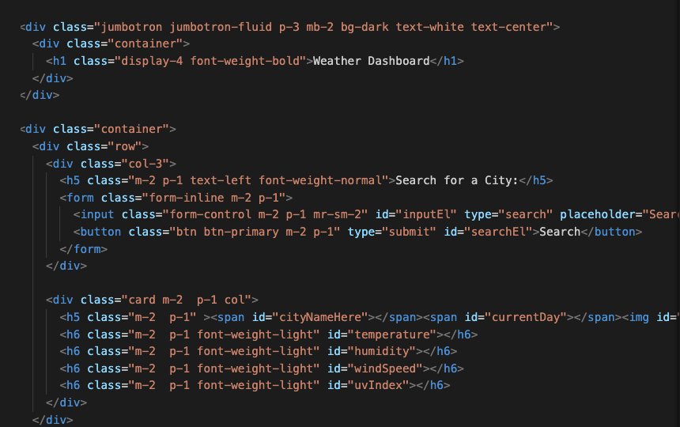
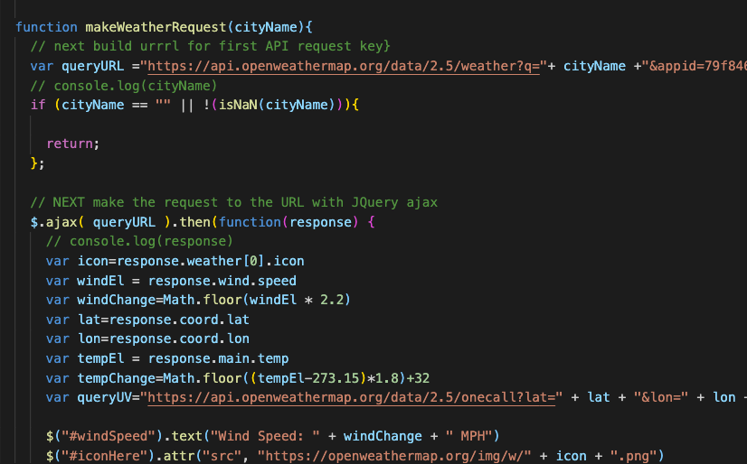
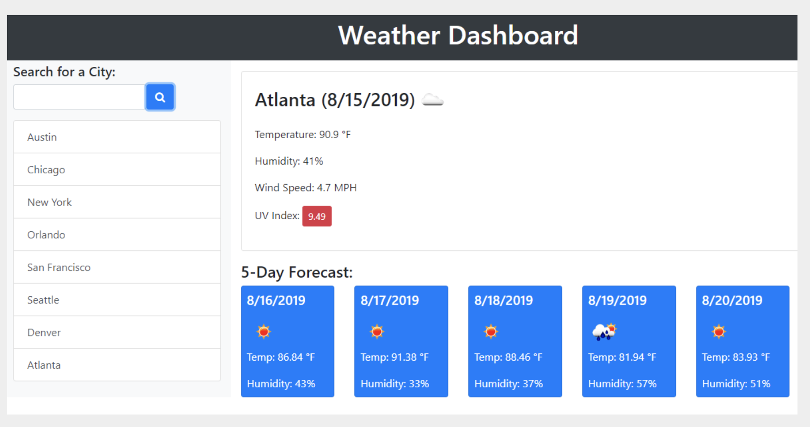

# Weather_Watcher

## Description
Planning to travel, or sitting at home wishing you could?  This is a weather app that allows you to search any city in the world, so you can find out that the weather is not any better in Seattle vs Toledo. Now you can look at the Thanksgiving you would have gone home to in the mid-west, and know you didn't actually miss anything.  

## Link to project 
[Weather_Watcher](https://lauragwendolynburch.github.io/Weather_Watcher/)

## Sample of JavaScript

## Sample of Project 

## User Notes
This was the hardest project so far.  I was not able to get my appended buttons to work, and I had to let go of trying to get a loop to pull the information for my 5 day.  Dry coding will hopefully come with some time.  

## Technologies Used 
[Moment.js](https://momentjs.com/)

[Open Weather one call API](https://openweathermap.org/api/one-call-api)

[Open Weather Ultraviolet Index](https://openweathermap.org/api/uvi)

## License
N/A